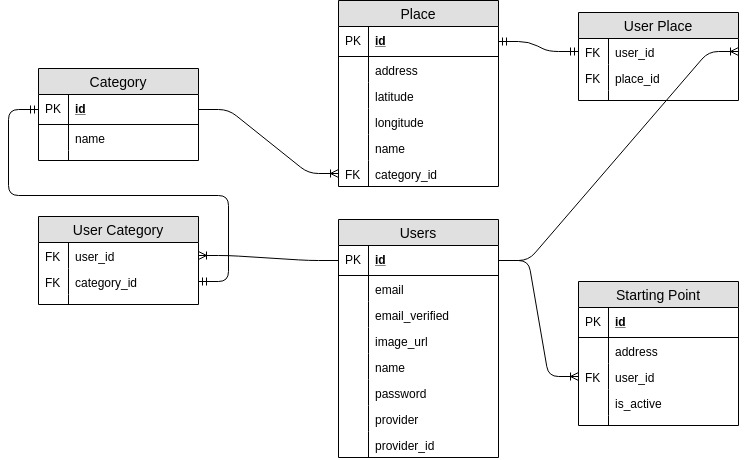

# guide-me

### What is this?

An app that lets you select an adress, some categories and see how far is your point from places 
in those categories.
E.g. you want to know which shopping mall in Cracow is closest to your home, just select your 
address as your starting point, and check "Shopping mall" category, then under "places" you'll 
see all Cracow shopping centres and their distances to you.

### What's inside?

The backend server in Java that provides an api and authorization was created with [Spring 
Initializr](https://start.spring.io/), handles OAuth2, database, and provides endpoints for frontend app.

The frontend app was created with [create-react-app](https://github.com/facebook/create-react-app).
It communicates with the backend server and provides UI for signing up/in, selecting starting 
point, categories and getting distances for places.

The app is available on [heroku](https://gdme-client.herokuapp.com/).

### How to build it locally?

First, setup your own database in application.yml.

To start the server on port 8081:
```bash
./mvnw spring-boot:run
```

To start client app on port 3000:
```bash
cd guide-me-client
npm start
```

### How does the database look?


